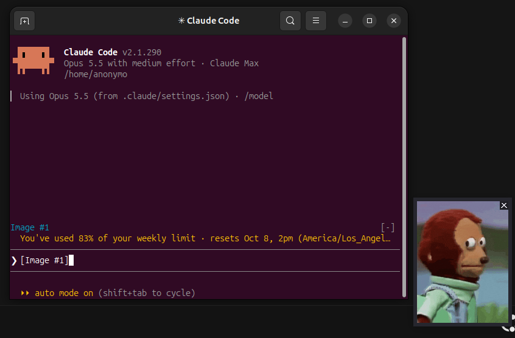

# paste-preview

See the images you paste into Claude Code before you send them.

Claude Code shows a pasted image only as an `[Image #N]` tag, so it's easy to attach the wrong screenshot. With this plugin, every image in your draft gets a label next to the prompt and a small preview window:



- **Pasting** an image opens a small preview of every image in your draft, side by side. Click the preview (it has a × in its corner) to close it; it stays closed until you paste another image.
- **Click** any label to open or close the preview.
- The row clears, and any preview closes, when you send the prompt or remove the image from the draft.

On Linux it also makes **Ctrl+V image paste work without installing `xclip` or `wl-clipboard`**.

It works in any terminal, including inside [herdr](https://github.com/herdrdev/herdr): the preview is its own window, so it doesn't depend on the terminal's image support.

## Install

**Linux and macOS:**

```sh
curl -fsSL https://raw.githubusercontent.com/0010aor/claude-paste-preview/main/install.sh | sh
```

**Windows** (PowerShell):

```powershell
irm https://raw.githubusercontent.com/0010aor/claude-paste-preview/main/install.ps1 | iex
```

Both download a small helper, `claude-paste-helper` (a single self-contained binary, checksum-verified), and install the plugin. The helper goes to `~/.local/bin` on Linux and macOS and to `%LOCALAPPDATA%\claude-paste-preview` on Windows; the plugin finds it there even when that folder isn't on your PATH. Then restart Claude Code.

**Uninstall:** run the same command with `--uninstall` (`... | sh -s -- --uninstall`), or on Windows `& ([scriptblock]::Create((irm https://raw.githubusercontent.com/0010aor/claude-paste-preview/main/install.ps1))) -Uninstall`.

Without the helper (plugin only: `claude plugin marketplace add 0010aor/claude-paste-preview` then `claude plugin install paste-preview@paste-preview`), labels still appear and clicking one opens the image in your default viewer; macOS falls back to Quick Look.

## Platforms

The same behaviour everywhere: pasting opens a small preview window of all pasted images at the bottom-right of the main screen, a click on it closes it, a click on a label toggles it, and sending closes it.

| | Preview window | Paste images (Ctrl+V) | Needs installing |
| --- | --- | --- | --- |
| **Linux** (X11, or Wayland with XWayland) | X11 window | built in, or through the helper if no `xclip`/`wl-paste` | nothing; the installer adds the helper |
| **macOS** (Apple Silicon and Intel) | AppKit panel | built in | nothing; the installer adds the helper |
| **Windows** (x86_64) | Win32 window | built in | nothing; the installer adds the helper |

Tested so far on Linux only (Ubuntu, GNOME on Wayland, GNOME Terminal and herdr, Claude Code 2.1.289 in fullscreen and default modes, with `xclip`, `wl-clipboard` and kitty uninstalled). The macOS and Windows windows compile and pass CI's build and unit tests, but nobody has run them on a real machine yet; reports are welcome. The plugin needs a Claude Code version with function-hook plugins (2.1.289 or newer; the API is marked early access).

## Limitations

- **Clicking labels needs Claude Code's fullscreen mode** and a terminal that reports the mouse. In the default mode, and inside herdr (whose pixel-precise mouse reports don't line up with the pane), the labels don't react to clicks; the preview still opens on paste and closes with a click on the preview itself.
- **Another plugin drawing above the prompt.** If another plugin takes the row above the prompt without passing it on, the labels move to the hint line under the prompt instead.
- **Over SSH** there is no local display for the preview window, and Ctrl+V reads the remote machine's clipboard. Drag the file into the terminal or paste its path instead; Claude Code attaches it either way.
- **The `xclip` stand-in** is only created when no `xclip` or `wl-paste` exists, as `~/.local/bin/xclip`. Because `~/.local/bin` usually comes first on PATH, it keeps shadowing a real `xclip` you install later. Run the uninstaller first, or delete that link. It implements only the options Claude Code and most scripts use (`-selection`, `-t`, `-o`, `-i`), and refuses others.
- **Depends on a Claude Code internal.** Claude Code saves each pasted image as `<temp>/claude-<uid>/<project>/<session>/images/<N>.png`. If a release moves those files, the labels stop appearing; nothing else breaks.
- **Previews show PNGs**, which is what Claude Code saves pasted images as.

## How it works

The plugin polls the prompt draft every 300 ms for `[Image #N]` tags. Pasting an image doesn't fire Claude Code's prompt-edit hook, so polling is the only way to notice it. For each tag it finds the saved image file and draws a label above the prompt (or on the hint line under it, when another plugin holds that row). A new paste opens the preview of all the draft's images at once; the labels are one small UI module that reports clicks back to the plugin, which toggles that preview (or opens the clicked file in the default viewer where there is no previewer).

The helper (`helper/`, Rust, no runtime dependencies) draws the preview with each system's own window API (X11, AppKit, Win32), and on Linux also stands in for `xclip`:

- **`claude-paste-helper preview IMAGE.png...`** opens a borderless, always-on-top window with the images side by side, each scaled to at most 320×200 (smaller when many share the strip); clicking it closes it. It decodes the PNG row by row, uses about 10 MB even for a 4K screenshot, and exits when its parent does.
- **Invoked as `xclip`** (Linux), it reads and writes the clipboard over the X11 selection protocol, including large (INCR) transfers. XWayland bridges that to the Wayland clipboard on Wayland desktops.

The plugin and helper make no network requests. The installer contacts GitHub only to download the helper.

## Development

```sh
claude plugin test plugins/paste-preview      # plugin tests
claude plugin validate plugins/paste-preview
(cd helper && cargo test && cargo clippy -- -D warnings)
sh tests/install_test.sh                      # installer, against a throwaway HOME
```

To try local changes, install from your checkout:

```sh
(cd helper && cargo build --release --target x86_64-unknown-linux-musl)
sh install.sh --helper helper/target/x86_64-unknown-linux-musl/release/claude-paste-helper --marketplace .
```

Releases: pushing a `v*` tag builds the helper for Linux (x86_64, arm64), macOS (arm64, x86_64) and Windows (x86_64), each with a checksum (`.github/workflows/release.yml`). Cross-checking from Linux: `cargo check --target aarch64-apple-darwin` and `--target x86_64-pc-windows-gnu`.

## License

MIT
